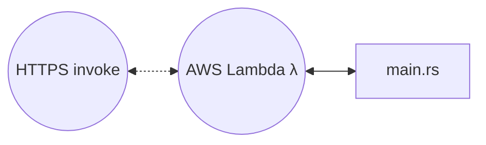
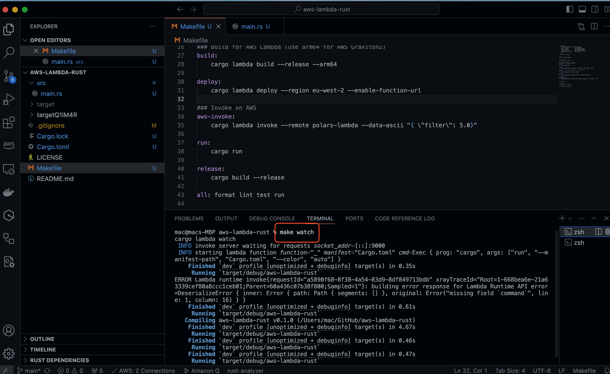
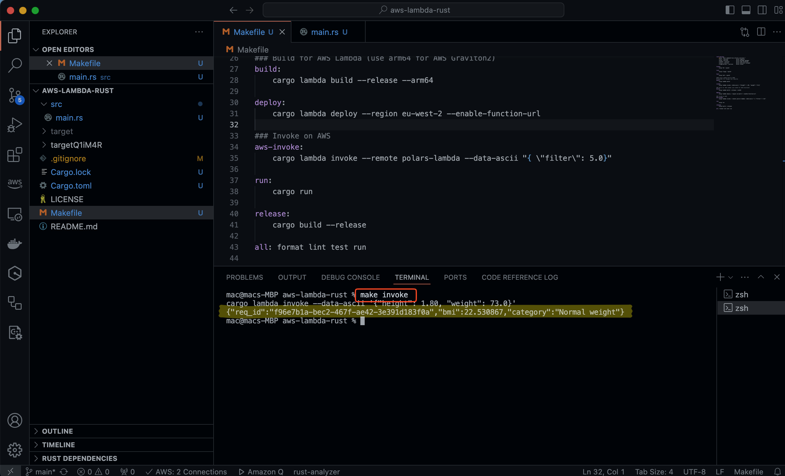
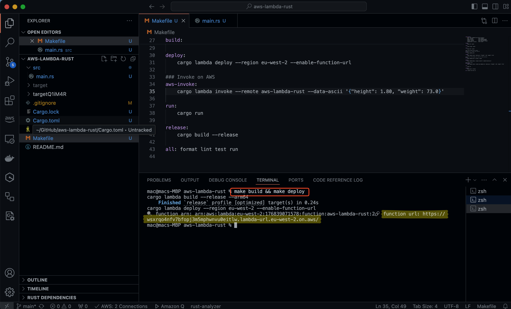
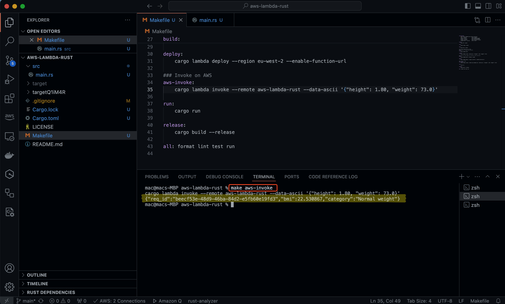
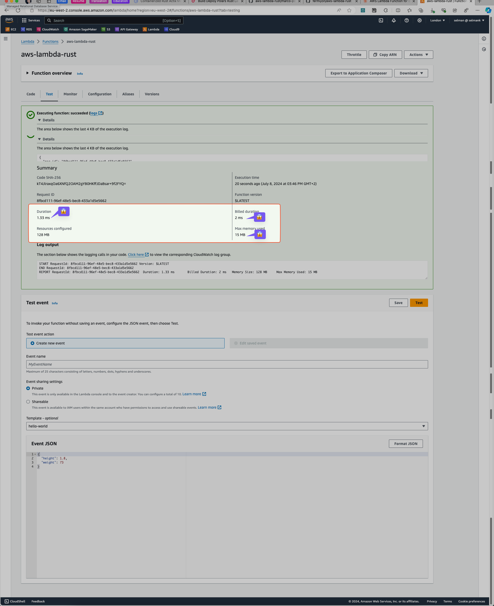

By Selman Karaosmanoglu 

## Date created

8 July 2024

# Rust Cargo-Lambda Deployment on AWS Lambda Serverless

## Overview

This repository provides a guide for deploying a Rust-based AWS Lambda function on AWS Lambda
utilizing Cargo-Lambda Rust library 

## Architecture



## Key Advantages of Rust for AWS Lambda
- _Memory Efficiency_: Rust uses significantly less memory compared to Python. This is because Rust is a compiled language with efficient memory management, while Python is an interpreted language with higher memory overhead.
- _Performance_: Rust offers substantial performance improvements over Python, often ranging from 10 to 1000 times faster, depending on the task.
- _Deployment_: Rust enables small binary deployments. By optimizing for size, Rust binaries can be significantly smaller than those of other languages.
- _Cost Efficiency_: Building on ARM architecture can be up to 34% cheaper, especially with processors like Amazon’s Graviton.
- _Energy Efficiency_: Rust is highly energy-efficient, often comparable to C, and significantly more efficient than languages like Python.
- _Fast Response Times_: Rust can achieve very low response times, often as low as 2 milliseconds, due to its efficient execution and low-level control.

## Getting Started

## Install Rust

If you don't have Rust on your system install rust using https://rustup.rs

```bash
curl --proto '=https' --tlsv1.2 -sSf https://sh.rustup.rs | sh
```

## Install Cargo lambda

Cargo Lambda simplifies running, building, and deploying Rust functions on AWS Lambda without needing containers or VMs.

```bash
brew tap cargo-lambda/cargo-lambda
brew install cargo-lambda
```

For more information or other installation information on Cargo Lambda: https://www.cargo-lambda.info/guide/getting-started.html

## AWS CLI

### Make sure AWS CLI installed and configured.

If not, you can install with pip

```bash
pip install awscli
```

### Configure AWS

```bash
aws configure
```

## Testing locally

### Run the Rust app locally

```bash
make watch
```



### Test locally

```bash
make invoke
```



## Deploy to AWS

```bash
make build && make deploy
```



## Test deployed app

```bash
make aws-invoke
```



### Lambda Function Summary



## Reference

* Rust AWS Lambda - O'Reiily 
