By Selman Karaosmanoglu 

## Date created

8 July 2024

# Rust Cargo-Lambda Deployment on AWS Lambda Serverless

## Overview

This repository provides a guide for deploying a Rust-based AWS Lambda function on AWS Lambda
utilizing Cargo-Lambda Rust library 

## Architecture

```mermaid
flowchart LR;
    A((HTTPS invoke)) <-.-> B((AWS Lambda λ));
    B <--> C[main.rs];
```



## Getting Started

## Install Rust

If you don't have Rust on your system install rust using https://rustup.rs

```bash
curl --proto '=https' --tlsv1.2 -sSf https://sh.rustup.rs | sh
```

## Install Cargo lambda

Cargo Lambda simplifies running, building, and deploying Rust functions on AWS Lambda without needing containers or VMs.

```bash
brew tap cargo-lambda/cargo-lambda
brew install cargo-lambda
```

For more information or other installation information on Cargo Lambda: https://www.cargo-lambda.info/guide/getting-started.html

## AWS CLI

### Make sure AWS CLI installed and configured.

If not, you can install with pip

```bash
pip install awscli
```

### Configure AWS

```bash
aws configure
```

## Testing locally

### Run the Rust app locally

```bash
make watch
```


### Test locally

```bash
make invoke
```


## Deploy to AWS

```bash
make build && make deploy
```


## Test deployed app

```bash
make aws-invoke
```


### Lambda Function Summary


## Reference

* Rust AWS Lambda - O'Reiily 
